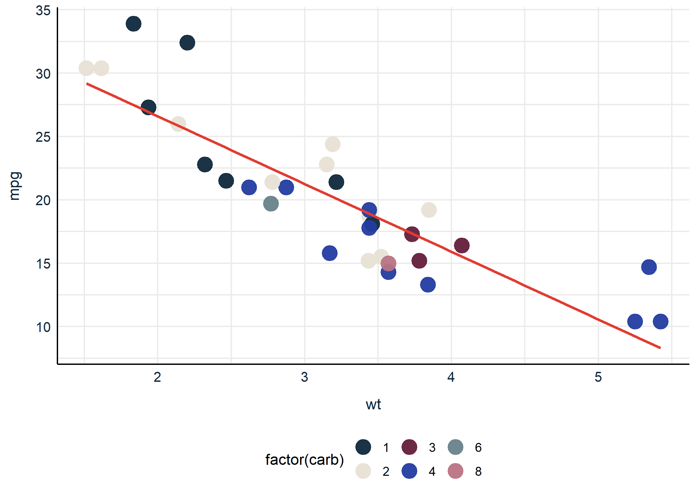
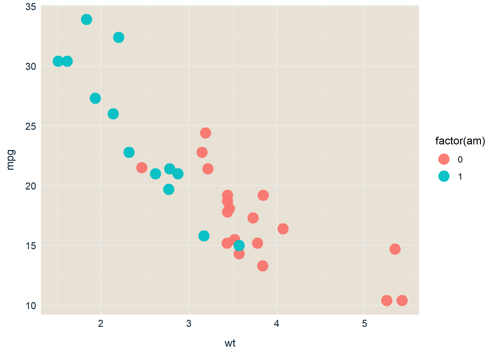
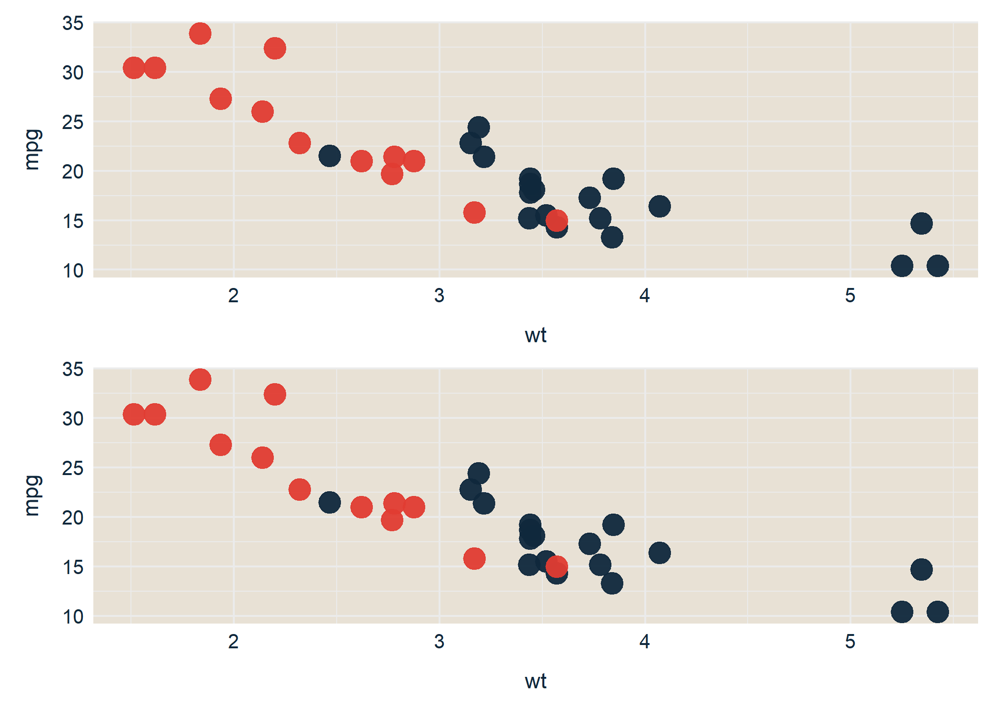
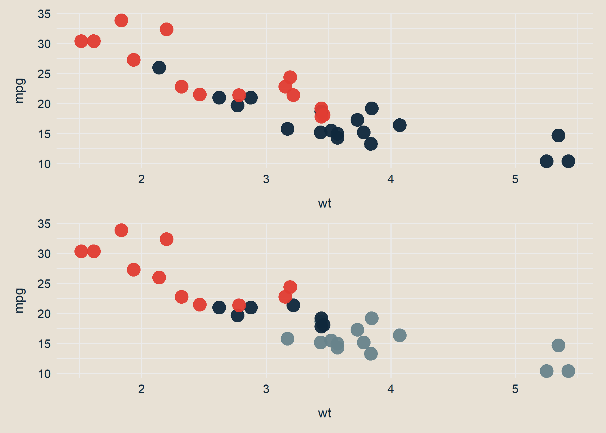

<!-- README.md is generated from README.Rmd. Please edit that file -->

# repinion

<!-- badges: start -->

[](https://www.codefactor.io/repository/github/jvieroe/repinion)
[]()
[](https://lifecycle.r-lib.org/articles/stages.html#experimental)
[](https://cran.r-project.org/package=repinion)

[](https://github.com/jvieroe/repinion/actions)
<!-- badges: end -->

The goal of `repinion` is to provide Epinion employees with `ggplot2`
functionality that quickly and easily makes your graphs compliant with
the Corporate Visual Identity (CVI).

## Quick example

`repinion` has two main functionalities:

1.  tailor-made `ggplot2` themes
2.  a set of custom-made color palettes for both discrete and continuous
    variables

<!-- end list -->

``` r
library(repinion)
library(tidyverse)

ggplot(mtcars, aes(x = wt,
                   y = mpg,
                   color = factor(carb))) +
  geom_point(size = 5,
             alpha = .95) +
  epitheme_classic() +
  color_epi_d()
```



## Installation

You can install the development version from
[GitHub](https://github.com/) with:

``` r
if(!require("devtools")) install.packages("devtools")
library(devtools)
devtools::install_github("jvieroe/repinion")
```

## **Epinion** `ggplot()` themes

Use `epitheme_*()` to quickly apply a tailormode `ggplot` theme to your
graphs and data visualizations. This makes them compliant with the
company CVI and serves as a time-saver, especially when producing
numerous plots. At the moment, two Epinion theme exists:
`epitheme_classic()`, designed for most visualization purposes, and
`epitheme_map()`, a very minimalist theme designed with geospatial maps
in mind.

`epitheme_classic()` takes three arguments as inputs.

  - `legend`, specifying whether to include a legend
  - `gridlines`, specifying whether to include horizontal and/or
    vertical gridlines
  - `textcolor`, for specifying text color applied to theme text (axis
    labels, axis titles etc.)

`epitheme_map()` does not take the `gridlines` argument but is otherwise
functionally similar.

``` r
ggplot(mtcars, aes(x = wt,
                   y = mpg,
                   color = factor(am))) +
  geom_point(size = 5,
             alpha = .95) +
  epitheme_classic(legend = T,
                   gridlines = "both")
```



Evidently, `epitheme_classic()` only impacts `ggplot2::theme()` elements
and not the aesthetics of your actual plot. We can override `theme()`
elements inherent to `repinion::epitheme_classic()` by specifying this
in `theme(...)` **afterwards**.

`epitheme_classic()` only impacts `ggplot2::theme()` elements and not
the aesthetics of your actual plot.

## The **Epinion** color palette

You can apply custom-made Epinion color palettes with `repinion` through
different (more or less verbose) approaches

### Using the **Epinion** color palette

`repinion` provides easy access to the colors from the Epinion CVI:

``` r
getcols_epi()
#>           Epinion Red      Epinion DarkBlue      Epinion WarmSand 
#>             "#E13C32"             "#0F283C"             "#E8E1D5" 
#>    Epinion DarkPurple     Epinion ClearBlue Epinion LightDeepBlue 
#>             "#641E3C"             "#233CA0"             "#68838B" 
#>   Epinion LightPurple     Epinion LightBlue         Epinion Green 
#>             "#BA7384"             "#A7C7D7"             "#004337" 
#>    Epinion LightGreen          Epinion Gold     Epinion LightGold 
#>             "#73A89A"             "#C18022"             "#EBC882"
getcols_epi("Epinion DarkBlue")
#> Epinion DarkBlue 
#>        "#0F283C"
```

We can use these to manually change our colors by either (1) using the
HEX codes provided by `getcols_epi()` directly or (2) by pasting the
names into the `base::getElement()` function:

``` r
library(gridExtra)

# use the HEX codes directly
p1 <- ggplot(mtcars, aes(x = wt, y = mpg, color = factor(am))) +
  geom_point(size = 5, alpha = .95) +
  epitheme_classic(legend = F) +
  scale_color_manual(values = c("#0F283C", "#E8E1D5"))

# use the color names
p2 <- ggplot(mtcars, aes(x = wt, y = mpg, color = factor(am))) +
  geom_point(size = 5, alpha = .95) +
  epitheme_classic(legend = F) +
  scale_color_manual(values = c(getElement(getcols_epi(), "Epinion DarkBlue"),
                                getElement(getcols_epi(), "Epinion WarmSand")))

grid.arrange(p1, p2, ncol = 2) ; rm(p1, p2)
```



### Applying the color palette directly

`repinion` also allows you to apply the Epinion color palette in more
verbose fashion. This can be applied to both continuous and discrete
variables and for both `aes(color =)` and `aes(fill =)`:

**Discrete variables**

  - `color_epi_d`: to use with the `aes(color = x)`, where x is a
    `factor` or `character` variable
  - `fill_epi_d`: to use with the `aes(fill = x)`, where x is a `factor`
    or `character` variable

**Continuous variables**

  - `color_epi_c`: to use with the `aes(color = x)`, where x is a
    `numeric` or `integer` variable
  - `fill_epi_c`: to use with the `aes(fill = x)`, where x is a
    `numeric` or `integer` variable

The main argument taken by all four functions is `reverse` which allows
you to reverse the order of the color scale (default is `FALSE`)

``` r
p1 <- ggplot(mtcars, aes(x = wt, y = mpg, color = factor(cyl))) +
  geom_point(size = 5, alpha = .95) +
  epitheme_classic(legend = F) +
  color_epi_d()

p2 <- ggplot(mtcars, aes(x = wt, y = mpg, color = factor(cyl))) +
  geom_point(size = 5, alpha = .95) +
  epitheme_classic(legend = F) +
  color_epi_d(reverse = T)

p3 <- ggplot(mtcars, aes(x = wt, y = mpg, fill = disp)) +
  geom_point(size = 5, shape = 21, color = "NA", alpha = .95) +
  epitheme_classic(legend = F, gridlines = "y") +
  fill_epi_c()

p4 <- ggplot(mtcars, aes(x = wt, y = mpg, fill = disp)) +
  geom_point(size = 5, shape = 21, color = "NA", alpha = .95) +
  epitheme_classic(legend = F, gridlines = "y") +
  fill_epi_c(reverse = T)

grid.arrange(p1, p2, p3, p4, ncol = 2) ; rm(p1, p2, p3, p4)
```



#### Additional options: `*_epi_d()`

  - When mapping `color_epi_d()` or `fill_epi_d()` to a variable with
    **only two levels**, you can manually choose colors with the
    `primary` and `secondary` arguments

#### Additional options: `*_epi_c()`

  - `repinion` contains six different continuous color palettes:
    `epiblue`, `epipurple`, `epigreen`, `epigold`, `epiredblue`, and
    `epidarkblue`.
  - You choose between these with the `palette` option in
    `color_epi_c()` and `fill_epi_c()`

# Acknowledgements

  - The R Core Team for developing and maintaining the language
  - Hadley Wickham ([hadley](https://github.com/hadley)) and the rest of
    the team working on the amazing `ggplot2` package (and, frankly, the
    entire `tidyverse` ecosystem)
  - Garrick Aden-Buie ([gadenbuie](https://github.com/gadenbuie)) and Dr
    Simon Jackson ([drsimonj](https://github.com/drsimonj)) for
    inspiration
